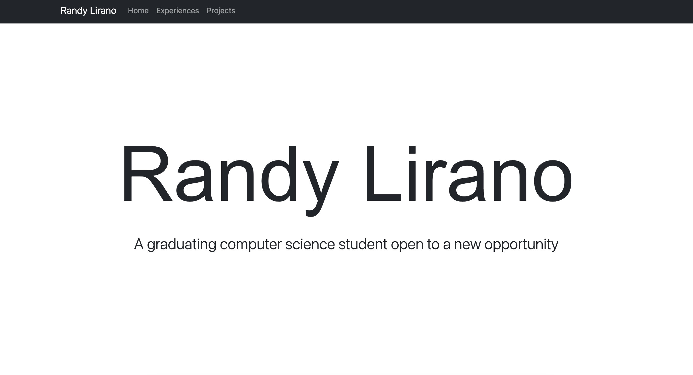

# Randy Lirano's Website

### Objective
This project was intended to get familiar with basic web development languages and technologies such as HTML, CSS, and JavaScript. This website will be a live website that will be updated periodically, and hosted on GitHub. This website will be used to show my experiences such as employment, project, and educations.

### Screenshot

### How-To-Use
Install `reload` to run a local server, and run the website locally.
Install reload: `npm install -g reload`

run `reload -b` at the root directory

At the root folder of this project, run `npm install` to locally install all dependencies.

### Relevant Links
[Demo](https://youtu.be/I0tSgRstfFs)
[Slides](https://docs.google.com/presentation/d/1g_2GQcMZbP8G2Q9pqTADalX9t7NnIYS3vHpDMyk766s/edit?usp=sharing)
[Class](https://johnguerra.co/classes/webDevelopment_fall_2021/)
